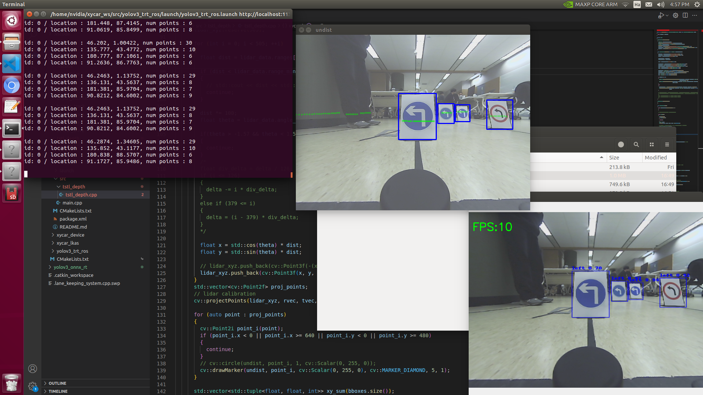

# Traffic Sign Depth Estimation

## Team Introduction
- 팀원 및 역할 소개

    송원석 : 자이카 패키지 구성

    임해룡 : AWS 관리 및 딥러닝 모델 학습, 캘리브레이션

    정지훈 : 데이터 수집 및 라벨링

    조원영 : 데이터 수집 및 라벨링

    전체 : 센서퓨전 및 거리 측정 알고리즘 개발

## Object Detection
- 객체 인식을 위한 적용 모델

yolov3-tiny

- 데이터 증강(Data Augmentation) 적용 방법

좌우반전, sharpening, 어파인 변환, 밝기 변환, 색조 변환 (default)

- 객체 인식을 위한 추가적인 알고리즘 소개

학습 전 이미지 왜곡 보정.
프로젝트 목적에 맞게 traffic sign 전체부분이 포함되도록 labeling policy 수정.

- 모델 학습을 위한 하이퍼파라미터 설정 및 선정 이유

class 개수 변경 및 anchor size 조절.

- 학습 과정 및 결과

400장의 이미지를 이용해 학습. 7700epoch 학습 후 결과는 아래와 같다.

## Distance Estimation
- Camera/LiDAR Calibration 방법

**Camera Intrinsic**

chessboard를 사용해 intrinsic calibration.

**Camera Extrinsic**

45 cm 간격으로 object를 두고 사진을 촬영해 object point, image point(왜곡보정 후)를 얻어 find homography 수행.
(탁구공 프로젝트에서만 사용.)

**Camera - Lidar Calibration**

Rviz와 move_base_simple / goal topic을 통하여 Lidar 좌표를 구함.
lidar의 위치와 camera 픽셀 값을 확인하여 Extrinsic Calibration 진행.

- Calibration Result

이미지 왜곡이 보정되었고, lidar points가 이미지 상에 잘 투영되었다.

- 객체의 위치(거리) 추정 방법

**탁구공**

Homography 행렬을 이용해 탁구공과 지면이 닿는 점을 추정하여 위치 추정.

**Traffic Sign**

2D Lidar를 이용해 바운딩박스 내부에 포함된 point들의 값을 평균내 위치 추정.
2D Lidar가 약 4도정도 기울어져(pitch) 이를 보정하기 위해 Lidar - Xycar 좌표계 사이의 Transform을 계산해 적용해주었다.

- Camera 기반의 거리추정 방법의 장/단점

    장점 : 저렴한 센서인 카메라만으로 쓸만한 거리를 추정할 수 있다. 

    단점 : 물체가 지면에 붙어 있지 않으면 추정이 불가능하다. 또한 바운딩박스의 위치에 크게 영향을 받는다.

- Camera/LiDAR 기반의 거리추정 방법의 장/단점

    장점 : 카메라에 비해 정확도가 높다. 

    단점 : 복잡한 캘리브레이션 과정이 수반된다.

## 결과 이미지

